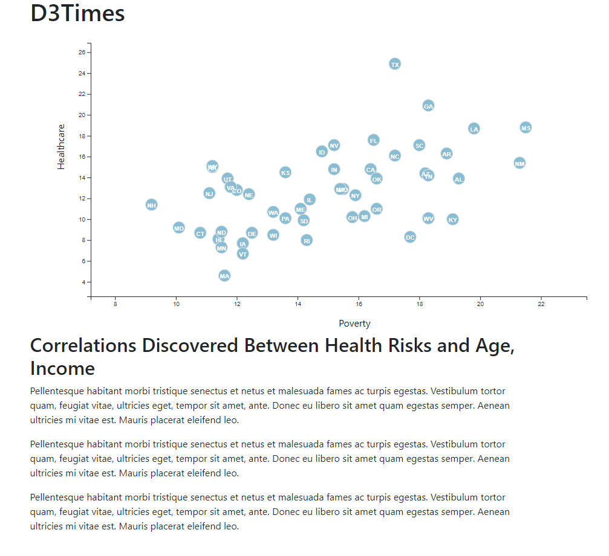

# D3-Health_Risk_vs_Demogrpahics
By utilizing *d3.js*, this html page visualizes the health risks facing particular demographics based on [2014ACS 1-year estimates](static/data/data.csv). The current data set includes data on rates of income, obesity, poverty, etc. by state. The page displays scatter plot for Poverty vs Healthcare. Each state should be represented with circle elements with state abbreviations  using an *app.js*.

### Tech Stack
* JavaScript
* CSS
* HTML

### User Instructions
* Clone the repository: git clone https://github.com/DarrylB32/D3-Health_Risk_vs_Demogrpahics 
*  In command: python -m http.server 
*  In web browser: http://localhost:8000/
* 
 
### Additional Notes
Transitions will be added to the graphs such that the user can choose between different graphs and the plots will rearrange themselves.